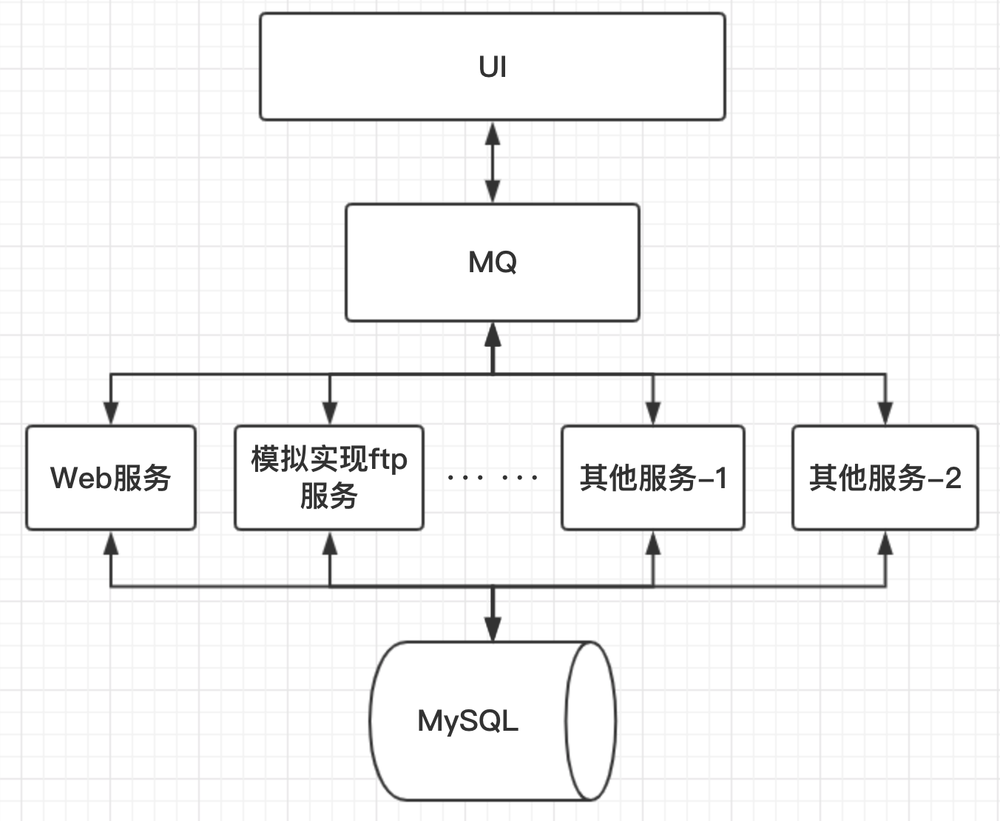

# ssmServer
# 一、项目宗旨：
- 该项目的整个开发过程会清晰地展示给读者，方式在“三、版本递进说明”会详细解释。
- 我们希望读者通过阅读这个项目源码，亲身感受到“ssm框架是怎么使用”以及“ssm框架的作用如何在项目中发挥”
- 总的来说，读者可以通过这个项目达到“结合实例学习ssm框架”的目的

# 二、项目特点：
1. 实现前后端分离
2. 依赖MQ中间件完成前后端交互
3. 代码注释很全面，认真看都能看懂

## 1.前端：VUE框架

## 2.媒介：MQ

## 3.后端：
- ### 1.SSM框架
    - #### IOC
    - #### AOP
    - #### log4j
- ### 2.服务部署环境
    - #### Nginx（反向代理服务器，用于增加并发量）
    - #### Tomcat（JavaWeb服务运行环境）
    - #### JDK（链接JavaWe与MySQL）
    - #### MySQL（数据持久化）
- ### 3.服务框架
 
# 三、版本递进说明
## 1.项目分支结构大体如下：
- master
- feature_wy
- feature_lz
- version_2.0
- ... ...
- version_1.1
- version_1.0

## 2.说明：
> **master**：整个项目的总分支

> **feature_xx**：开发者在各自的feature分支上开发，读者不用看

> **version_x.y**：每当项目开发到一个阶段，就创建一个对应的版本分支，读者可以根据版本递进，一步一步学习ssm框架；比如version_1.0分支对应的阶段就是“ssm框架基本配置完成”；在每个版本分支的README.md中对该版本“做了什么事”都有详细的介绍