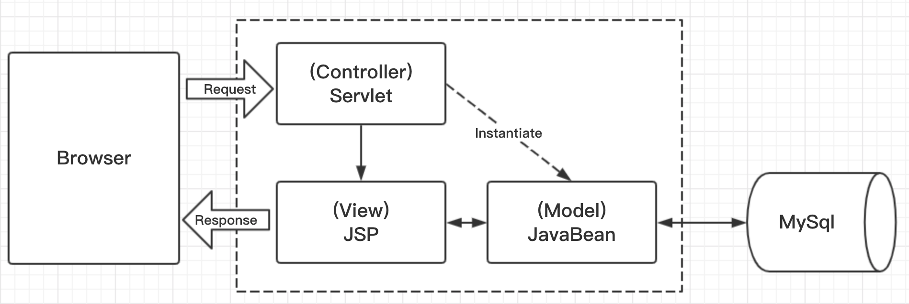
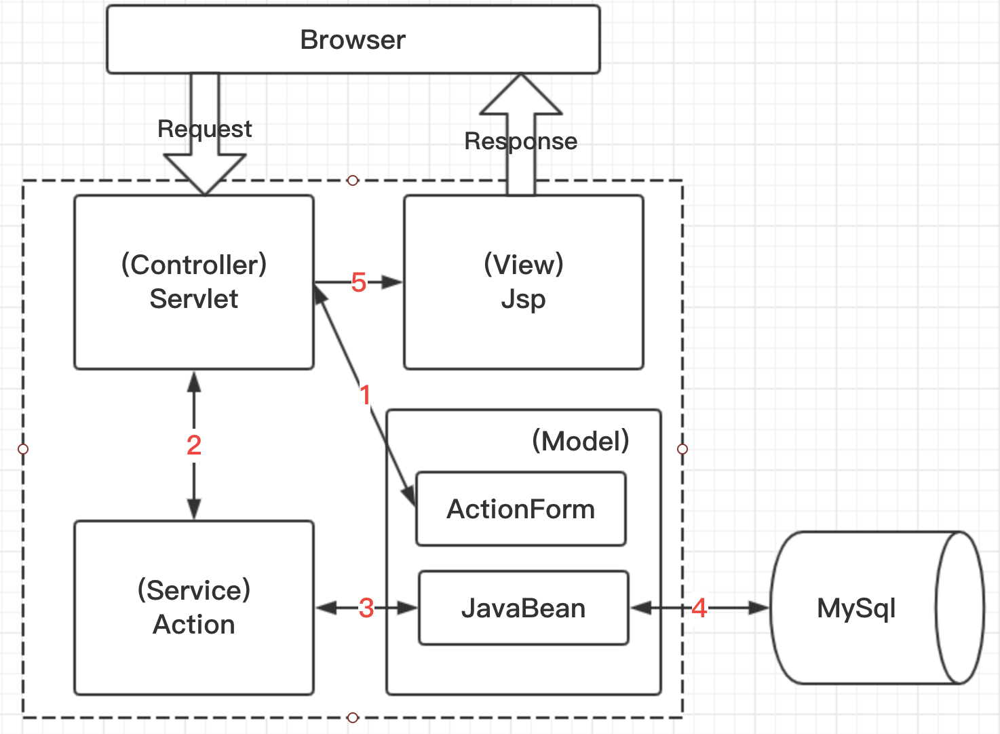

<h1 >ssmServer：版本1.0</h1>

<h2 >0.当前版本已完成的事</h2>

- “ssm框架基本设置完成”，如何搭建按照[2.文件结构解释](#2)

<h2 >1.读者必做事项：</h2>

- 按照当前分支所包含的所有文件以及文件内容配置ssm框架
- 每个文件（基本都是配置文件）都有很全的注释说明，强烈建议把每个都看一遍，看懂！
- 在终端cd到项目根目录下，使用mvn mybatis-generator:generate指令，看看会发生什么哟～

<h2 id="2">2.文件结构解释</h2>

- ssmServer（整个项目的文件夹,对应创建maven-webapp项目时填写的ArtifactId）
    - .idea（都是配置文件，主要跟maven有关，删除也无影响，只不过下次打开项目又会重新生成，重新配置一次）
    - src
        - main（自己创建）
            - java（自己创建，并设置为Sources Root）
                - com（自己创建，对应创建maven-webapp项目时填写的GroupId）
                    - lw（自己创建，对应创建maven-webapp项目时填写的GroupId）
                        - controller（存放前端url映射文件的接口）
                        - dao（存放与数据库交互的接口文件）
                        - model（存放数据文件）
                            - actionform（前端url请求生成的表单）
                            - entity（实体类文件，每个实体类对应一个数据表）
                        - service（存放自定义的接口）
                            - action（处理actionform的接口）
            - resources（自己创建，并设置为Resources Root）
                - spring（自己创建）
                    - applicationContext.xml（spring配置文件）
                - sqlmap（存放实体与数据库的映射文件）
                - generator.properties（mybatis的配置文件，可以用它结合mvn mybatis-generator:generate指令自动生成实体类）
                - generator.xml（mybatis的配置文件）
                - jdbc.properties（数据库相关信息）
                - log4j.properties（日志配置文件）
            - webapp（maven创建Web工程自带,存放前端资源）
                - cs（自己创建，存放cs文件）
                - image（自己创建，存放图片文件）
                - js（自己创建，存放js文件）
                - WEB-INFO（maven创建Web工程自带，在改目录下的文件不可以直接访问，必须在web.xml中对访问文件做相应映射才能访问）
                    - views（自己创建，存放jsp文件）
                    - web.xml（Web应用程序配置文件，描述了 servlet 和其他的应用组件配置及命名规则） 
    - pom.xml（整个项目依赖的框架的包都在这里设置，即依赖配置文件，具有依赖管理的功能）
    - README.md（项目说明文件）
    - ssmServer.iml（工程配置文件，不用管）
- External Libraries（所有依赖的包）
- Scratches and Consoles（临时的文件编辑环境，这个功能是idea用来测试一小段代码的或者是某个语句某个api等，非常的方便，可以不管）

<h2>3.SpringMVC框架图</h2>

> SpringMVC和MVC的区别是什么呢？
>
> 1.百度百科：MVC全名是Model View Controller，是一种软件设计典范，用一种业务逻辑、数据、界面显示分离的方法组织代码，将业务逻辑聚集到一个部件里面，在改进和个性化定制界面及用户交互的同时，不需要重新编写业务逻辑。
> 
>2.MVC分为三部分，分别是:
- > Model：模型，表示应用程序核心，比如数据记录列表
- > View：显示，对数据进行显示
- > Controller：控制器，对数据库的各种操作进行控制
>
>3.SpringMVC就是java语言实现的MVC，它使用Spring中的技术来完成MVC三层中的操作，比如Model层中对象的实例化就由Spring中的IOC依赖注入完成；或者使用AOP完成MVC中的事务控制等。

<h2>4.项目框架图</h2>

